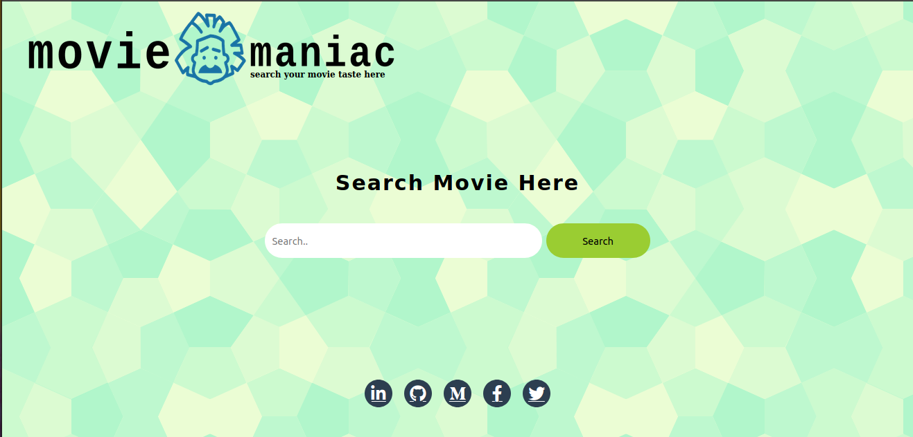
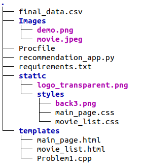

# Movie-Recommendation-Web-App

# Overview

This is a content based movie recommendation web application hosted on Heroku. Just enter one movie name then it will recommend 25 movies.

# Demo
Link: https://nikmoviemaniac.herokuapp.com/

# Dataset used
I have used TMDB 5000 movie dataset.              
This dataset containd two csv files:
  1. tmdb_5000_credits.csv
  2. tmdb_5000_movies.csv

Link to dataset: https://www.kaggle.com/tmdb/tmdb-movie-metadata

# Directory tree

# Tool used

# Language used

# Technologies used
  
